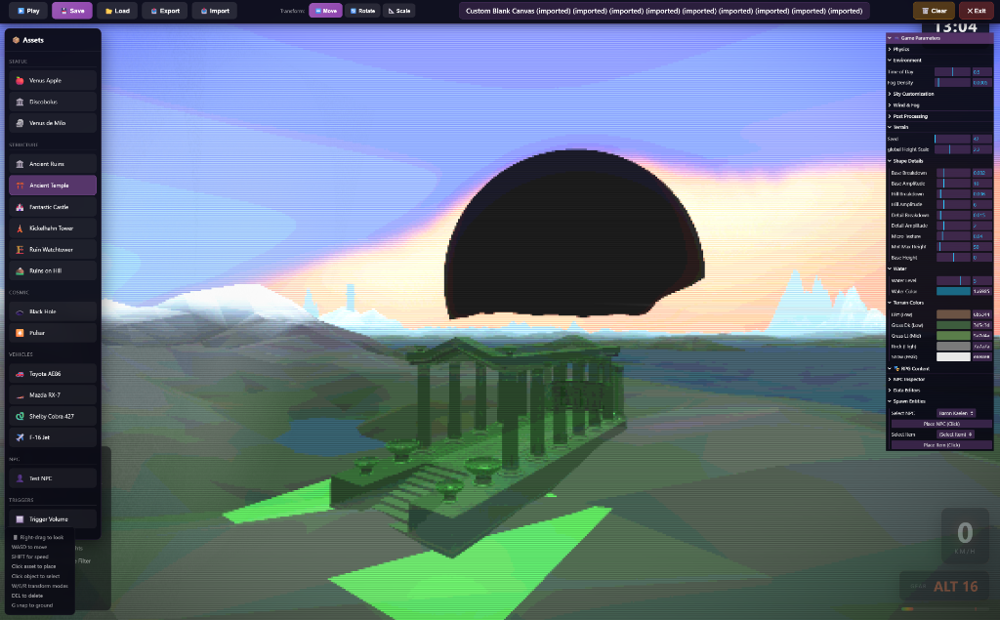
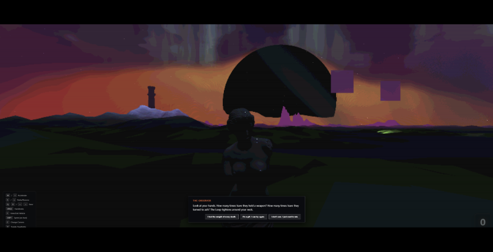
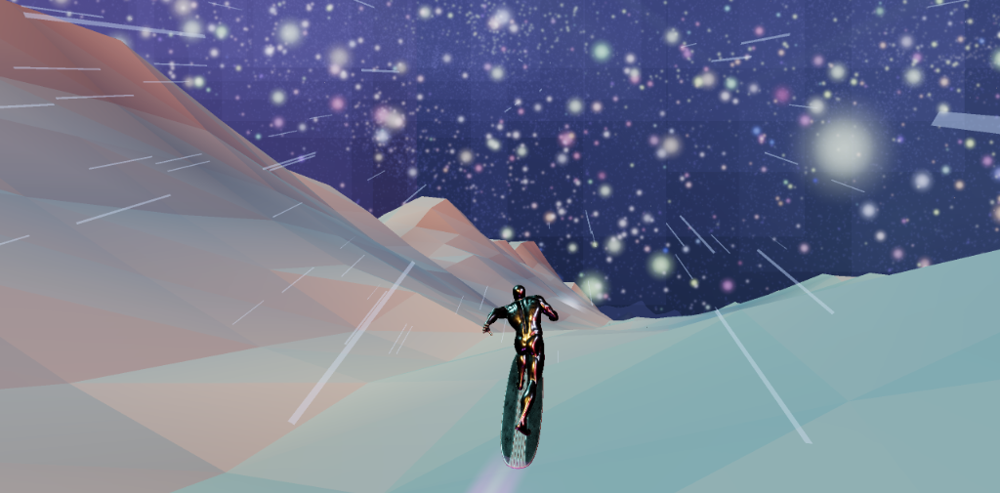
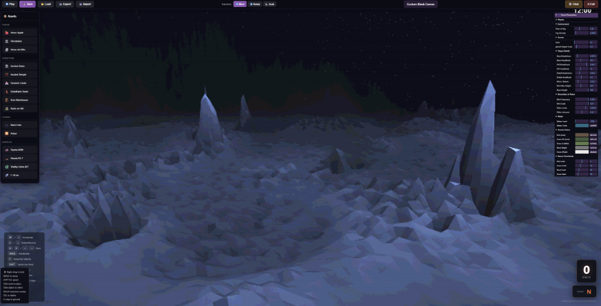

# 🏎️ Universal Racing & RPG Simulator

> **A browser-based, high-fidelity vehicle simulation engine evolving into an open-world RPG.**  
> Features realistic raycast vehicle physics, 6-DOF aerodynamics, infinite procedural terrains, and a rich narrative quest system.


---

## 📸 Gallery

| | |
|:---:|:---:|
| <br>_Dynamic Day/Night Cycle & Volumetric Fog_ | <br>_Real-time Level Editor with Asset Library_ |
| <br>_Narrative Events & Cosmic Phenomena_ | <br>_6-DOF Flight & Surfing Mechanics_ |


_Infinite Procedural Terrains (e.g., Crystallized Moon)_

---

## 📚 Table of Contents
- [✨ Key Features](#-key-features)
- [🎮 Controls & Input](#-controls--input)
- [🗺️ RPG Systems](#-rpg-systems)
- [🛠️ Creative Studio (Editor)](#-creative-studio-editor)
- [🏎️ Physics Engine Deep Dive](#-physics-engine-deep-dive)
- [🌌 Rendering & Visuals](#-rendering--visuals)
- [🔧 Technical Architecture](#-technical-architecture)
- [🚀 Content Overview](#-content-overview)
- [📝 Installation](#-installation)

---

## ✨ Key Features

### 🌍 Open-World RPG
- **Quest System**: Engage in multi-stage narrative missions. Track objectives via the HUD.
- **Interactive NPCs**: Talk to characters like "Mechanic Mike" or the mysterious "Observer".
- **Dialogue Trees**: Branching conversations with choices that affect outcomes.
- **Inventory & Economy**: Collect parts, trade items, and upgrade your vehicle.

### 🏎️ & ✈️ Hybrid Simulation
- **Raycast Chassis**: 4-point independent suspension with compression damping and bump stops.
- **Tire Model**: Pacejka-inspired friction curves with surface-dependent grip (Tarmac, Ice, Sand, Dirt).
- **Aerodynamics**: 6-DOF physics with thrust vectoring, stalling, and banking mechanics.
- **Walker Mode**: Get out of the car! Explore on foot with First-Person control.
- **Drift Logic**: Custom friction curve allowing for sustained, controllable slides.

### 🎨 Creative Studio
- **In-Game Editor**: Fly-camera based editor to place objects, ramps, and cosmic phenomena in real-time.
- **Procedural Objects**: Configure black holes, nebulae, and loop-the-loops with tweakable parameters.
- **Visual Filters**: Switch between **Retro 16-bit** (`F4`), **ASCII** (`F6`), and **Halftone** (`F7`) shaders.
- **Save/Load System**: Export your custom tracks (including RPG data) to JSON and share them.

---

## 🎮 Controls & Input

The game handles seamless switching between **Driving**, **Flying**, **On-Foot**, and **Editor** modes. Supports Keyboard & Mouse and Gamepad (DualSense/Xbox).

### 🚶 On-Foot (Walker Mode)
| Action | Keyboard | Gamepad |
|--------|----------|---------|
| **Move** | `W` `A` `S` `D` | `Left Stick` |
| **Look** | Mouse | `Right Stick` |
| **Sprint** | `Shift` | `L3` |
| **Interact/Talk** | `E` | `Square` / `X` |
| **Enter Vehicle** | `F` | `Triangle` / `Y` |
| **Jump** | `Space` | `Cross` / `A` |

### 🚗 Driving
| Action | Keyboard | Gamepad |
|--------|----------|---------|
| **Throttle** | `W` | `R2` / `RT` |
| **Brake/Reverse** | `S` | `L2` / `LT` |
| **Steer** | `A` `D` | `Left Stick` |
| **Handbrake** | `Space` | `Circle` / `B` |
| **Nitro** | `Shift` | `L3` |
| **Headlights** | `H` | - |
| **Shift Up/Down** | `E` / `A` | `R1` / `L1` |

### ✈️ Flight Controls
| Action | Keyboard | Gamepad |
|--------|----------|---------|
| **Pitch** (Nose Up/Down) | `W` / `S` | `Left Stick Y` |
| **Roll** | `Q` `D` | `Right Stick X` |
| **Yaw** (Rudder) | `A` / `E` | `L1` / `R1` |
| **Thrust** | `Shift` | `R2` |
| **Air Brake** | `S` | `L2` |
| **Hover Mode** | `X` | `Cross` / `A` |

### 🛠️ Editor & System
| Action | Key | Description |
|--------|-----|-------------|
| **Toggle Editor** | `F9` | Switch between Play and Editor mode instantly. |
| **Retro Filter** | `F4` | Toggle CRT/Pixel shader. |
| **ASCII Filter** | `F6` | Toggle Matrix-style ASCII rendering. |
| **Halftone Filter** | `F7` | Toggle Comic book style. |
| **Time Scale** | `[` `]` | Speed up or slow down time. |
| **Freeze Time** | `T` | Pause the day/night cycle. |
| **Debug Lines** | `P` | Show suspension rays and physics forces. |

---

## 🗺️ RPG Systems

The simulation now features a persistence layer for role-playing elements.

### 🗣️ Dialogue & Quests
- **Interaction**: Approach an NPC and press `E`. A letterboxed cinema view will trigger.
- **Branching**: Your choices matter. Some options require specific items or reputation levels.
- **Quest Log**: Tracking is automatic. Notifications appear (Top Left) when objectives are updated.
- **Rewards**: Completing quests grants XP, Money, or unique Vehicle Parts.

### 💾 Save System
- **Auto-Save**: Character progress (XP, Inventory) and World State (Placed objects) are saved to `LocalStorage`.
- **JSON Export**: You can export your entire level, including custom NPC placement and quests, via the Editor.

---

## 🛠️ Creative Studio (Editor)

Access the editor by pressing `F9` or selecting it from the Main Menu.

### Core Tools
- **Fly Cam**: `Right-Click + WASD` to navigate the scene freely. `Shift` for speed boost.
- **Transform Gizmos**:
    - `W`: Translate (Move)
    - `E`: Rotate
    - `R`: Scale
- **Snapping**: Press `G` to snap the selected object to the terrain heightmap.

### ⚙️ Game Parameters Panel
Located in the top-right, this panel (lil-gui) offers deep control:
- **Physics**: Adjust global `Gravity`, `Friction`, and `Air Resistance`.
- **Environment**: Real-time control of `Time of Day` (Sun position), `Fog Density`, and Cloud coverage.
- **Post-Processing**:
    - **Bloom**: Threshold, Strength, Radius.
    - **Retro**: Pixel Size, Scanline Intensity, Noise, Vignette.
    - **ASCII**: Character set count, Zoom level, Color inverting.

### 🎬 Deep Animator (New)
Access via `F8`. A dedicated tool for character animation.
- **Inspect Mode**: Click any character to view its State Machine constants and current Active Clip.
- **Pose Mode**:
    - select bones and rotate them with Gizmos.
    - Capture keyframes to create new animations.
    - Export to JSON.

### 📦 Asset Library
- **Structures**: Ancient Temples, Castles, Sci-Fi Towers.
- **Cosmic**:
    -   **Black Holes**: Raymarched volumetric rendering with gravitational lensing and accretion disk.
    -   **Pulsars**: High-energy variant emitting relativistic jets.
    -   **Spatial Anomalies**: Glitching, crystal-like structures with procedural noise shaders.
-   **Vehicles**: Spawn drivable cars or static props.
- **NPCs**: Place quest givers or ambient characters directly into the world.

---

## 🏎️ Physics Engine Deep Dive

### 📐 New Car Physics (`new_car_physics.js`)
State-of-the-art rigid body simulation tailored for arcade-simulation balance.
-   **Integration**: Uses semi-implicit Euler integration for stability.
-   **Inertia Tensor**: Approximated box inertia tensor allows for realistic tumbling and mid-air rotation.
-   **Suspension**:
    *   **Hooke's Law**: $F = -k \cdot x - c \cdot v$ (Spring + Damping).
    *   **Bump Stops**: Hard collision response when suspension bottoms out ($x > travel$).
-   **Tire Friction**:
    *   Separates **Longitudinal** (Acceleration/Braking) and **Lateral** (Cornering) forces.
    *   **Slip Ratio**: Calculates wheel spin relative to ground speed for realistic burnouts.
    *   **Circle of Friction**: Clamps total tire force using $F_{max} = \mu \cdot F_{normal}$.
-   **Drift Mechanics**:
    *   Detects high slip angles to engage "Drift State".
    *   Modifies lateral friction coefficients dynamically to allow sustained slides without spinning out.
    *   Applies "Speed Boost" to steering at high velocities to counter understeer.

### ✈️ Flight Dynamics (`plane.js`)
6-Degrees-of-Freedom (6-DOF) physics model.
-   **Aerodynamics**: Lift and Drag forces are calculated based on velocity squared and angle of attack.
    *   *Lift*: $L = 0.5 \cdot \rho \cdot v^2 \cdot C_L \cdot A$
    *   *Drag*: $D = 0.5 \cdot \rho \cdot v^2 \cdot C_D \cdot A$
-   **Thrust Vectoring**: Allows for VTOL-like maneuvers (Hover Mode).
-   **Ground Effect**: simulated "cushion" when flying close to terrain.

---

## 🌌 Rendering & Visuals

### Dynamic Sky System
-   **Atmospheric Scattering**: Custom fragment shader (`sky.js`) blends horizon, zenith, and sun colors based on Rayleigh scattering approximation.
-   **Volumetric Fog**: Density varies by biome (e.g., thick sandstorms in Dunes, clear void in Deep Space).
-   **Starfield**:
    *   Procedural generation of 15,000+ stars with individual size and color attributes.
    *   **Milky Way**: Rendered using a combination of point clouds and a custom GLB model with emissive materials.
    *   **Twinkle Shader**: Stars shimmer based on time uniforms in the vertex shader.

### Post-Processing Pipeline
1.  **RenderPass**: Main scene render.
2.  **UnrealBloomPass**: High-dynamic-range glow (critical for neon levels and stars).
3.  **Retro16BitShader**: Custom shader that quantizes colors (5-6-5 bits) and adds pixelation/scanlines for a vintage aesthetic.
4.  **ASCII / Halftone**: Stylized shaders for unique visual signatures.

---

## 🔧 Technical Architecture

The project follows a modular, component-based architecture designed for extensibility.

```bash
Racing/
├── index.html              # Main entry point (DOM structure, UI overlay)
├── styles.css              # Glassmorphism UI, HUD, and Editor styling
├── js/
│   ├── main.js             # Game Bootstrapper & State Machine (Menu/Play/Editor)
│   │
│   ├── core/               # Central Systems
│   │   ├── input.js        # Universal input handler (Keyboard + Gamepad)
│   │   ├── camera.js       # Camera controller (Chase, Cockpit, Fly modes)
│   │   ├── car.js          # Car entity logic
│   │   ├── plane.js        # Plane entity logic & Aerodynamics
│   │   └── player.js       # On-foot first-person controller
│   │
│   ├── physics/            # Deterministic Physics Engine
│   │   ├── new_car_physics.js  # The custom RigidBody + Suspension engine
│   │   └── physics-provider.js # Interface for terrain collision queries
│   │
│   ├── rpg/                # RPG Layer
│   │   ├── systems/        # Logic (DialogueSystem, QuestManager, InventoryManager)
│   │   ├── data/           # JSON Databases (Quests, Items, NPCs)
│   │   └── ui/             # UI Controllers (DialogueOverlay, QuestTracker)
│   │
│   ├── environment/        # Visual Enivronment (Sky, Stars, Wind)
│   │
│   ├── terrain/            # Infinite Terrain Generators (Strategy Pattern)
│   │   ├── terrain.js      # Base class & Simplex noise utils
│   │   ├── deep-space.js   # Void generator
│   │   ├── city.js         # Procedural city grid generator
│   │   └── ...             # (dunes.js, everest.js, ice-mountain.js, etc.)
│   │
│   └── editor/             # Level Editor System
│       ├── EditorController.js    # Editor state logic & UI bindings
│       ├── SceneObjectManager.js  # Gizmos & Object placement logic
│       ├── AssetLibrary.js        # Registry of placeable props
│       └── RPGEditorController.js # RPG-specific tools (NPC spawner)
│
└── assets/                 # Binary Assets
    ├── models/             # GLTF/GLB 3D models (Cars, Plane, Props)
    └── texture/            # Textures & Sprites
```

### Architectural Highlights

1.  **State Machine**: The game operates efficiently by sequestering logic into three distinct states: `MENU`, `PLAY` (Physics active), and `EDITOR` (Fly-cam active).
2.  **Physics Decoupling**: The physics engine is completely decoupled from Three.js. It accepts an Input state and a `PhysicsProvider`, outputting raw position/quaternion data. This allows for fixed timestep updates.
3.  **Strategy Pattern**: All terrains share a common interface. adding a new world is as simple as extending `TerrainGenerator`.
4.  **RPG Manager**: A singleton that acts as the brain for the narrative layer, coordinating the Quest, Dialogue, and Inventory systems alongside the main game loop.

---

## 🚀 Content Overview

### Terrains
1.  **Grasslands**: Rolling procedural hills. Good for testing suspension.
2.  **Desert Dunes**: Large-scale sand simulation with high friction drag.
3.  **The Everest**: 10km² map starting at 800m elevation. Extreme downhill physics.
4.  **Deep Space**: Zero-gravity feel (visual only), infinite void. Features volumetric galaxies, nebulae, black holes, and spatial anomalies.
5.  **Vaporwave**: "Neon Horizon". Infinite highway with synthwave aesthetics.
6.  **City**: Procedural urban grid with skyscrapers by "Procedural City Generator".

### Vehicles
-   **Toyota AE86**: The drift king. RWD, lightweight, loose rear end.
-   **Mazda RX-7**: Rotary power. Higher grip, higher top speed.
-   **Shelby Cobra**: High torque V8. Requires careful throttle control.
-   **F-16 Jet / Stunt Plane**: High thrust-to-weight ratio, extremely agile.

---

## 📝 Installation

1.  **Clone the project**
    ```bash
    git clone https://github.com/yourusername/racing-sim.git
    cd racing-sim
    ```

2.  **Start a local server**  
    *Due to ES6 Modules and CORS security for textures/models, you cannot just open `index.html`.*
    
    Using Node.js (npx):
    ```bash
    npx -y serve .
    ```
    
    Using Python:
    ```bash
    python -m http.server 8000
    ```

3.  **Launch**
    Open `http://localhost:3000` (or the port shown in your terminal).

---

**License**: Educational / Personal Use.  
**Credits**: Built with [Three.js](https://threejs.org/).
