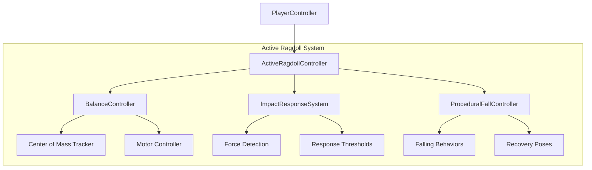
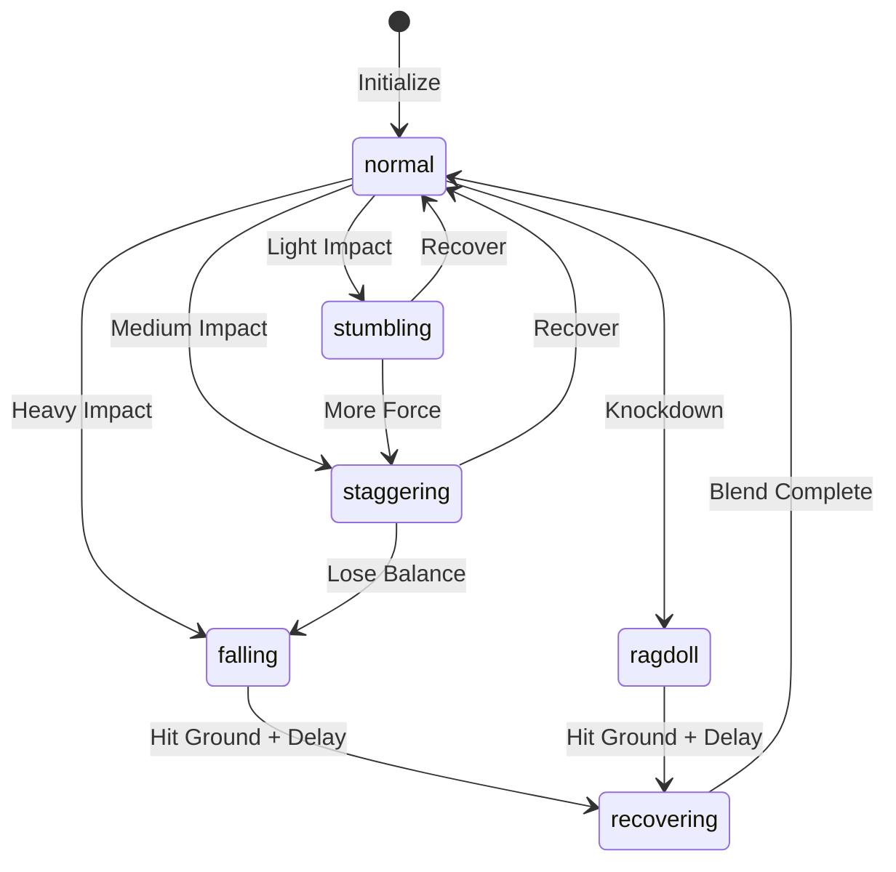

# 🎮 Active Ragdoll System (Euphoria-Style)

> **Physics-driven procedural animation system** for realistic falling, balance, and impact reactions.

---

## 📊 Overview

The Active Ragdoll System provides Euphoria-style character physics where entities:
- **Actively try to maintain balance** when pushed or hit
- **React proportionally to impacts** (stumble, stagger, or fall)
- **Protect themselves when falling** (arm bracing, head tucking)
- **Recover naturally** with smooth blending back to animation

This goes beyond traditional ragdoll physics by adding **active motor control** — characters don't just go limp, they fight to stay upright.

---

## 🏗️ Architecture



---

## 📁 File Structure

```
js/animation/physics/
├── ActiveRagdollController.js   # Main orchestrator
├── BalanceController.js         # Balance tracking & motor control
├── ImpactResponseSystem.js      # Impact detection & categorization
├── ProceduralFallController.js  # Falling behaviors
└── RagdollConfig.js             # Tunable parameters
```

---

## 🚀 Usage

### Basic Integration (Already done in PlayerController)

```javascript
import { ActiveRagdollController } from '../animation/physics/ActiveRagdollController.js';

// After mesh loads
this.ragdoll = new ActiveRagdollController(this.mesh, {
    terrain: this.terrain,
    entity: this,
    characterHeight: this.specs.height
});

// In update loop (AFTER animation update)
if (this.ragdoll) {
    this.ragdoll.update(dt);
}
```

### Applying Impacts

```javascript
// Light push (stumble)
player.applyImpact(
    new THREE.Vector3(0, 0, -100),  // Force
    null,                            // Point (optional)
    'push'                           // Source
);

// Heavy hit (fall)
player.applyImpact(
    new THREE.Vector3(-500, 0, 0),
    playerMesh.position.clone(),
    'vehicle_collision'
);

// Force a fall (for scripted events)
player.forceFall(new THREE.Vector3(0, 0, -1), 'heavy');
```

### Checking State

```javascript
// Check if player can be controlled
if (player.hasControl()) {
    // Process movement input
}

// Check if ragdoll is active
if (player.isRagdollActive()) {
    // Maybe pause certain systems
}

// Get full state for debugging
const state = player.getRagdollState();
console.log('Balance angle:', state.balance.balanceAngle);
```

---

## ⚙️ Configuration

All parameters are tunable in `RagdollConfig.js`:

### Impact Thresholds

| Threshold | Force | Response |
|-----------|-------|----------|
| Stumble | 50 | 1-2 recovery steps |
| Stagger | 150 | Multi-step recovery with arm flailing |
| Fall | 300 | Lose balance, hit ground |
| Knockdown | 600 | Instant ragdoll |

### Balance Settings

| Parameter | Default | Description |
|-----------|---------|-------------|
| stabilityConeAngle | 15° | Degrees from vertical before unstable |
| criticalAngle | 45° | Point of no return |
| recoverySpeed | 3.0 | How fast character corrects posture |

### Motor Strengths (0-1)

| Motor | Strength | Purpose |
|-------|----------|---------|
| spineStrength | 1.0 | Core stability |
| legStrength | 0.8 | Leg correction force |
| armStrength | 0.5 | Arm damping |
| headStrength | 0.7 | Head stabilization |

---

## 🔄 State Machine



---

## 🎯 Public API

### PlayerController Methods

| Method | Parameters | Returns | Description |
|--------|------------|---------|-------------|
| `applyImpact(force, point?, source?)` | Vector3, Vector3?, string? | string | Apply impact force, returns response type |
| `hasControl()` | - | boolean | Check if player can move |
| `isRagdollActive()` | - | boolean | Check if physics is active |
| `forceFall(direction, intensity?)` | Vector3, string? | void | Force character to fall |
| `forceRecovery()` | - | void | Skip to standing |
| `getRagdollState()` | - | Object | Get full debugging state |

### ActiveRagdollController Events

```javascript
new ActiveRagdollController(mesh, {
    onStateChange: (newState, oldState) => {
        console.log(`State changed: ${oldState} → ${newState}`);
    },
    onImpact: (source, magnitude) => {
        // Play sound, spawn particles, etc.
    }
});
```

---

## 🧪 Testing

### Quick Test (Browser Console)

You can use the new helper method which doesn't require creating Vector3 objects manually:

```javascript
// Access player through game object
const player = window.game.player;

// usage: player.testImpact(x, y, z)

// Test stumble (light push backward)
player.testImpact(0, 0, -80);

// Test stagger (medium hit from side)
player.testImpact(-200, 0, 0);

// Test fall (heavy hit)
player.testImpact(400, 0, -200);

// Test knockdown (massive hit)
player.testImpact(-700, 100, 0);
```

Or using the standard API (now `THREE` is globally available):

```javascript
// Force recovery
player.forceRecovery();

// Manual vector
player.applyImpact(new THREE.Vector3(0, 0, -100), null, 'test');
```

### Enable Debug Visualization

In `RagdollConfig.js`:
```javascript
debug: {
    showCOM: true,           // Show center of mass
    showSupportBase: true,   // Show support polygon
    showForces: true,        // Show impact forces
    logStateChanges: true,   // Log to console
}
```

---

## 🔗 Integration with Existing Systems

### Works With:
- ✅ **AnimationController** - Applies AFTER animation, blends smoothly
- ✅ **BlendTree1D** - Compatible with locomotion blending
- ✅ **Terrain** - Uses `getHeightAt()` for ground detection

### Future Integration:
- 🔲 **NPC System** - Apply to all entities with skeletons
- 🔲 **Vehicle Collision** - Auto-trigger on car hits
- 🔲 **Combat System** - Tie to attack hit detection
- 🔲 **Explosion System** - Radial force application

---

*Created: January 15, 2026*
