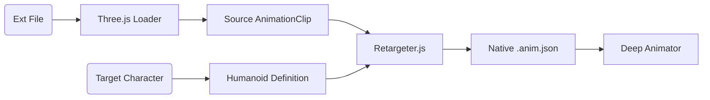

# 🗺️ Roadmap: Animation Import & Retargeting

**Status**: ✅ Implemented
**Parent Phase**: Phase 6 (Deep Animator Roadmap)
**Design Document**: [animation_import_design.md](./animation_import_design.md)

This roadmap tracks the implementation of the Animation Import system, enabling the Deep Animator to ingest external animations (Mixamo, Blender, FBX/BVH) and retarget them onto existing game characters.

---

## 📅 Phased Implementation Plan

### Phase 1: Core Infrastructure & Loaders 🏗️
**Goal**: Enable the application to load and parse external animation files into memory and visualize their raw skeleton structure.

- [x] **1.1 Dependency Integration**
    - [x] Import `FBXLoader` from three.js examples.
    - [x] Import `BVHLoader` (or equivalent parser).
    - [x] Verify `GLTFLoader` availability (already present).
- [x] **1.2 Raw Skeleton Visualization**
    - [x] Create `SkeletonViewer` utility class.
    - [x] Implement "Preview Skeleton" for loaded files (view bones without binding to a mesh).
    - [x] Add color-coding for Source (Imported) vs Target (Project) skeletons.
- [x] **1.3 Asset Pipeline**
    - [x] Implement file picker/drag-and-drop handler in `AnimatorEditorController`.
    - [x] Handle binary vs text parsing for different formats.

### Phase 2: The Logic Layer (Retargeter) 🧠
**Goal**: Implement the mathematical core that translates motion from one skeleton structure to another.

- [x] **2.1 Standard Humanoid Definition**
    - [x] Create `HumanoidAvatar.js` definition (Hips, Spine, Chest, Head, Limbs).
    - [x] Implement regex-based "Auto-Mapper" for common conventions (Mixamo `mixamorig:`, Unity `AvatarRoot`, etc.).
- [x] **2.2 Retargeting Math (`Retargeter.js`)**
    - [x] Implement **T-Pose Calibration**: Calculate rotational offsets between Source Rest Pose and Target Rest Pose.
    - [x] Implement **Pose Transfer**: `TargetBone.rotation = SourceBone.rotation * Offset`.
    - [x] Implement **Root Motion Scaling**: Scale hip translation by `TargetHeight / SourceHeight`.

### Phase 3: UI & Workflow 🎨
**Goal**: specific UI components for the import process.

- [x] **3.1 Import Dialog (`ImportDialog.js`)**
    - [x] Create modal container using existing `UIManager` styles.
    - [x] **Split View**: Left side (Source settings), Right side (Target settings).
    - [x] **Preview Area**: 3D view showing Source skeleton driving Target mesh.
- [x] **3.2 Bone Mapping UI**
    - [x] List view of Body Parts (Left Arm, Right Leg, etc.).
    - [x] Dropdowns for manual bone assignment if auto-map fails.
    - [x] Visual indicators (Green check = mapped, Red X = missing).
- [x] **3.3 Import Selection**
    - [x] List of animation clips found in the file.
    - [x] Checkboxes to select which clips to import.
    - [x] Rename fields (Input prefix/suffix).

### Phase 4: Integration & Refining 🚀
**Goal**: Convert retargeted data into the native editor format and save it.

- [x] **4.1 Clip Conversion**
    - [x] Convert `THREE.AnimationClip` (processed) into Editor's `KeyframeData` / JSON structure.
    - [x] Bake retargeted rotations into new keyframes.
- [x] **4.2 Editor Integration**
    - [x] "Import Animation" button in Toolbar.
    - [x] On success: Load new clips into the Animator's Action list.
    - [x] Auto-save new `.anim.json` files to the project.
- [/] **4.3 Verification**
    - [ ] Verify Mixamo FBX import (Walking, Running).
    - [ ] Verify Blender GLTF export.
    - [ ] Verify pure BVH motion capture data.

### Phase 5: Animation Library & Live Preview (Completed) 📚
**Goal**: Create a browsable library of animations that can be previewed on any character.

- [x] **5.1 Library Backend**
    - [x] Create JSON manifest system for library assets
    - [x] Implement background scanning of library folders
    - [x] Build `LibraryService` for caching and retrieval

- [x] **5.2 Library Panel**
    - [x] Create dockable, searchable library UI
    - [x] Implement category tree view
    - [x] Add drag-and-drop from library to character

- [x] **5.3 Real-time Preview**
    - [x] Implement one-click preview on selected character
    - [x] Auto-retargeting for preview playback
    - [x] "Apply" functionality to import permanently

## Phase 6: Advanced Visualization (Completed) 🕶️
**Goal**: Enhance the import dialog with rich 3D visualization.

- [x] **6.1 WebGL Dialog Preview**
    - [x] Embed `THREE.WebGLRenderer` inside the import DOM overlay
    - [x] Implement isolated scene for previewing source assets
    - [x] Add playback controls (Play/Pause, Scrub)

- [x] **6.2 Bone Mapping Visuals**
    - [x] Render source skeleton (red) and target skeleton (green)
    - [x] Draw connecting lines for mapped bones
    - [x] Color-code confidence levels (Green=High, Yellow=Medium, Red=Low)

---

## 🛠️ Architecture Overview

## 📝 Success Criteria

1.  **Zero-Jitter**: Retargeted animations should track smooth curves, not jittery sampling.
2.  **Root Motion Preservation**: Characters shouldn't slide; root motion should transfer correctly (or be optionally stripped).
3.  **Scale Agnostic**: A 100m giant skeleton should correctly animate a 1.8m human if the relative motion is identical.
