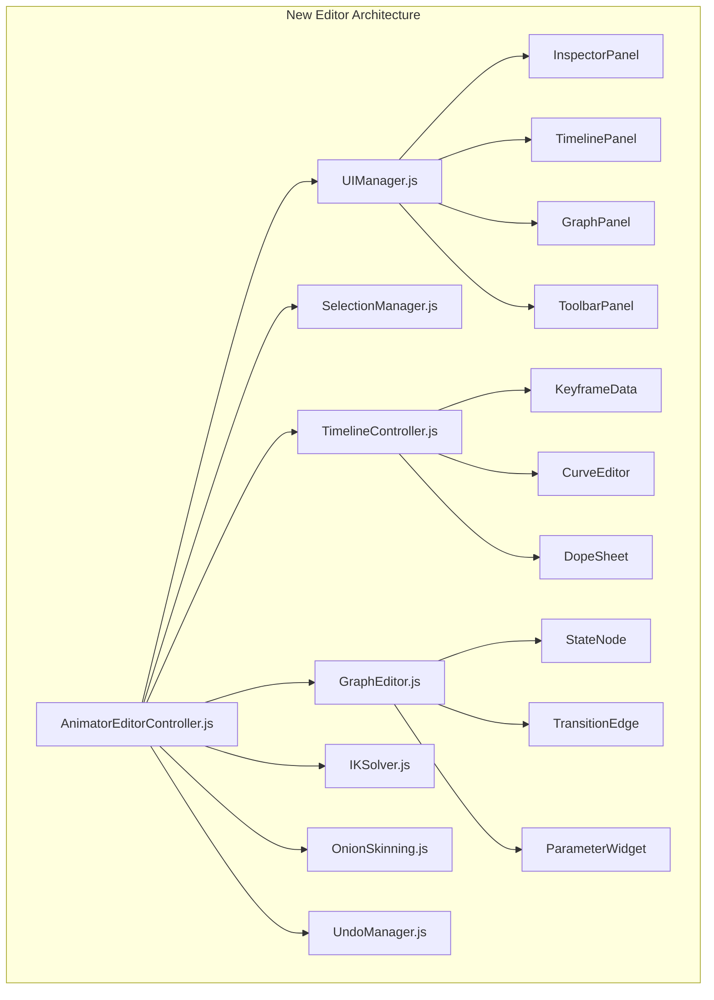

# 🎬 Deep Animator Editor - Complete Overhaul Roadmap

> **Vision**: Transform the basic Deep Animator into a **Unity-like, production-grade animation editor** with visual state machine graphs, a professional timeline/dope sheet, IK rigging, animation events, and real-time retargeting.

---

## 📸 Current State Analysis

### What We Have Now


*Inspect Mode: Entity selection, State Machine display, Parameters, Active Clip scrubber*


*Pose Mode: Bone helpers (green boxes), Move/Rotate tools, Keyframe capture, Preview, Export*

### Current Feature Inventory

| Feature | Status | Notes |
|---------|--------|-------|
| Entity Selection (click to inspect) | ✅ Working | Raycasts into scene, extracts animator |
| State Machine Display | ✅ Basic | Shows current state name, parameters |
| Parameter Editing | ✅ Basic | Sliders/checkboxes for FSM data |
| Clip Scrubber | ✅ Basic | Linear time scrub on active action |
| Pose Mode Toggle | ✅ Working | Shows skeleton helper + bone gizmos |
| Bone Selection | ✅ Working | Click green box → attach TransformControls |
| Keyframe Capture | ✅ Basic | Stores quaternion snapshots |
| Preview (Direct) | ✅ Basic | Slerp interpolation between poses |
| JSON Export | ✅ Basic | `AnimationClip.toJSON()` export |

### Critical Gaps (vs Unity Animator)

1. **No Visual State Machine Graph** - Can't see/edit transition rules visually
2. **No Timeline/Dope Sheet** - Linear keyframe list, no curves
3. **No Animation Curves** - Quaternion-only, no position/scale/custom properties
4. **No Onion Skinning** - Hard to see motion arcs
5. **No IK Handles** - FK-only bone manipulation
6. **No Animation Events** - Can't trigger sounds/effects at keyframes
7. **No Retargeting** - Animations tied to specific skeletons
8. **No Animation Blending Preview** - Can't visualize blend trees in editor
9. **No Additive Layer Preview** - Can't test layer masks
10. **No Undo/Redo** - Destructive editing

---

## 🏗️ Architecture Overview



---

## 🚀 Implementation Phases

---

### Phase 1: Editor Foundation & UI Overhaul
**Timeline**: Core infrastructure that enables all future features

#### 1.1 Modular UI System
- [ ] **[NEW] `js/editor/animator/ui/UIManager.js`**
  - Panel management (dock, undock, resize)
  - Theme system (dark mode by default)
  - Responsive layout (inspector left, timeline bottom, graph center)

- [ ] **Refactor `AnimatorEditorController.js`**
  - Extract `_buildUI()` / `_buildPoseUI()` into dedicated panel classes
  - Implement proper separation of concerns

- [ ] **[NEW] `js/editor/animator/ui/Toolbar.js`**
  - Tool buttons: Select, Move, Rotate, Scale, IK Handle
  - Play/Pause/Stop controls
  - Frame navigation (|◀ ◀ ▶ ▶|)
  - Snap settings (time, rotation)

#### 1.2 Undo/Redo System
- [ ] **[NEW] `js/editor/animator/core/UndoManager.js`**
  - Command pattern for all bone/keyframe modifications
  - History stack with configurable depth (default: 50)
  - Keyboard shortcuts: `Ctrl+Z` / `Ctrl+Shift+Z`

#### 1.3 Selection System Improvements
- [ ] **[NEW] `js/editor/animator/core/SelectionManager.js`**
  - Multi-bone selection (`Shift+Click`)
  - Hierarchy selection (`Ctrl+Click` selects children)
  - Selection groups/sets
  - Box selection for timeline keyframes

---

### Phase 2: Visual State Machine Graph Editor
**Timeline**: Unity's "Animator Window" equivalent

#### 2.1 Graph Canvas
- [ ] **[NEW] `js/editor/animator/graph/GraphEditor.js`**
  - Canvas-based node rendering (HTML Canvas or SVG)
  - Pan/Zoom controls (Middle mouse drag, scroll wheel)
  - Grid background with snap-to-grid

#### 2.2 State Nodes
- [ ] **[NEW] `js/editor/animator/graph/StateNode.js`**
  - Visual representation of FSM states
  - Color coding: Entry (green), Normal (gray), Any State (yellow)
  - Motion preview thumbnail when hovered
  - Connection ports (in/out)

```javascript
// Example State Node Data Structure
{
    id: 'state_idle',
    name: 'Idle',
    position: { x: 100, y: 200 },
    motion: 'idle_animation.anim.json',
    speed: 1.0,
    isDefault: true,
    transitions: ['to_walk', 'to_jump']
}
```

#### 2.3 Transition System
- [ ] **[NEW] `js/editor/animator/graph/TransitionEdge.js`**
  - Curved Bezier lines between states
  - Arrow heads indicating direction
  - Click to select and edit conditions

- [ ] **Transition Inspector**
  - Condition list: `Parameter`, `Operator`, `Value`
  - Blend settings: Duration, Offset, Interruption source
  - Has Exit Time checkbox

#### 2.4 Parameters Panel (Enhanced)
- [ ] **Expand existing parameter UI**
  - Add new parameter button (+)
  - Parameter types: `Float`, `Int`, `Bool`, `Trigger`
  - In-graph parameter widgets for testing

#### 2.5 Live State Highlighting
- [ ] **Real-time state visualization**
  - Highlight current active state in graph
  - Show transition progress bar during blending
  - Parameter value overlays

---

### Phase 3: Professional Timeline & Dope Sheet
**Timeline**: Industry-standard keyframe editing

#### 3.1 Timeline Foundation
- [ ] **[NEW] `js/editor/animator/timeline/TimelinePanel.js`**
  - Horizontal scrollable timeline area
  - Time ruler with frames/seconds toggle
  - Current time indicator (playhead)
  - Zoom in/out on timeline

#### 3.2 Dope Sheet View
- [ ] **[NEW] `js/editor/animator/timeline/DopeSheet.js`**
  - Hierarchical bone list (collapsible)
  - Diamond keyframe markers per bone
  - Color-coded by property (rotation=red, position=green, scale=blue)
  - Batch operations: Copy, Paste, Delete selected keyframes

```
| Bone          | 0s    | 0.5s  | 1s    | 1.5s  | 2s    |
|---------------|-------|-------|-------|-------|-------|
| ► Hips        |   ◆   |       |   ◆   |       |   ◆   |
|   └ Spine     |   ◆   |   ◆   |   ◆   |   ◆   |   ◆   |
|     └ Chest   |   ◆   |       |       |       |   ◆   |
|       └ Head  |   ◆   |   ◆   |       |   ◆   |   ◆   |
| ► LeftArm     |   ◆   |       |   ◆   |       |   ◆   |
```

#### 3.3 Curve Editor
- [ ] **[NEW] `js/editor/animator/timeline/CurveEditor.js`**
  - Bezier curve visualization for each property
  - Tangent handles (Smooth, Linear, Stepped)
  - Key value editing via number input
  - Curve presets: Ease In, Ease Out, Bounce, Elastic

#### 3.4 Timeline Playback
- [ ] **Enhanced playback controls**
  - Frame stepping (comma/period keys)
  - Loop region (set in/out points)
  - Playback speed slider (0.25x - 4x)
  - Audio waveform display (if audio attached)

---

### Phase 4: Advanced Posing & IK
**Timeline**: Professional character rigging tools

#### 4.1 IK Solver Integration
- [ ] **[NEW] `js/editor/animator/ik/IKSolver.js`**
  - CCD (Cyclic Coordinate Descent) algorithm
  - Pole vector constraints
  - Chain length configuration

- [ ] **[NEW] `js/editor/animator/ik/IKHandle.js`**
  - Visual IK target gizmo (distinct from FK)
  - Effector position/rotation controls
  - Blend weight between FK/IK

#### 4.2 IK Chains Configuration
- [ ] **Auto-detect common chains**
  - Arm IK: Shoulder → Elbow → Hand
  - Leg IK: Hip → Knee → Foot
  - Spine IK: Hips → Spine → Chest

- [ ] **UI for creating custom IK chains**
  - Pick bones from hierarchy
  - Set chain root and tip
  - Configure pole target

#### 4.3 Foot IK (Ground Adaptation)
- [ ] **[NEW] `js/editor/animator/ik/FootIK.js`**
  - Raycast to terrain
  - Automatic foot placement on slopes
  - Preview in editor with terrain debug lines

#### 4.4 Enhanced Bone Helpers
- [ ] **Improve visual bone representations**
  - Bone-shaped gizmos (octahedron/pyramid)
  - Size based on bone length
  - Joint rotation arcs/gimbal display
  - Axis display (local X=Red, Y=Green, Z=Blue)

---

### Phase 5: Animation Events & Layers
**Timeline**: Gameplay integration features

#### 5.1 Animation Events System
- [ ] **[NEW] `js/editor/animator/events/AnimationEvent.js`**
  - Event markers on timeline
  - Event types: Sound, Particle, Script Callback
  - Parameter passing (string, float, object reference)

```javascript
// Event data structure
{
    time: 0.5,
    type: 'callback',
    functionName: 'onFootstep',
    parameters: { foot: 'left', surface: 'grass' }
}
```

#### 5.2 Events Inspector
- [ ] **UI for adding/editing events**
  - Right-click timeline → Add Event
  - Event name, time, callback function dropdown
  - Preview events during playback

#### 5.3 Layer Preview
- [ ] **Visualize animation layers in editor**
  - Layer list with weight sliders
  - Mask visualization on skeleton
  - Toggle layers on/off for preview
  - See blending results in real-time

#### 5.4 Additive Animation Preview
- [ ] **Support additive blending preview**
  - Base layer + additive overlay
  - Weight curves for layers
  - Common use: Breathing, Hit reactions

---

### Phase 6: Onion Skinning & Motion Trails
**Timeline**: Motion visualization aids

#### 6.1 Onion Skinning
- [ ] **[NEW] `js/editor/animator/viz/OnionSkinning.js`**
  - Ghost meshes at configurable frame intervals
  - Backward frames (red tint)
  - Forward frames (green tint)
  - Opacity falloff by distance from current frame

- [ ] **UI Controls**
  - Toggle on/off
  - Frame range slider (-10 to +10)
  - Opacity slider
  - Step interval (every 1, 2, 5 frames)

#### 6.2 Motion Trails
- [ ] **[NEW] `js/editor/animator/viz/MotionTrail.js`**
  - Draw arc paths for selected bones
  - Useful for hand/foot motion arcs
  - Editable splines for path adjustment

---

### Phase 7: Retargeting & Import/Export
**Timeline**: Animation portability

#### 7.1 Humanoid Avatar Definition
- [ ] **[NEW] `js/editor/animator/retarget/HumanoidAvatar.js`**
  - Standard bone mapping (Unity-compatible naming)
  - Auto-detection of common rigs (Mixamo, UE Mannequin)
  - Manual bone assignment UI

```javascript
// Standard humanoid bone map
{
    Hips: 'mixamorig:Hips',
    Spine: 'mixamorig:Spine',
    Chest: 'mixamorig:Spine2',
    Head: 'mixamorig:Head',
    LeftUpperArm: 'mixamorig:LeftArm',
    // ...
}
```

#### 7.2 Animation Retargeting
- [ ] **[NEW] `js/editor/animator/retarget/Retargeter.js`**
  - Source → Target skeleton mapping
  - Bone length compensation
  - Rotation offset handling
  - Preview retargeted motion before applying

#### 7.3 Import Enhancements
- [ ] **Support additional formats**
  - BVH (Motion Capture)
  - FBX animations (via three.js FBXLoader)
  - Mixamo direct download integration

#### 7.4 Export Enhancements
- [ ] **Professional export options**
  - GLB/GLTF with embedded animation
  - Separate `.anim.json` files
  - Batch export (all clips in project)
  - Compression options (quantization)

---

### Phase 8: Performance & Polish
**Timeline**: Production readiness

#### 8.1 Performance Optimization
- [ ] **GPU-accelerated rendering**
  - Instanced bone helpers
  - Frustum culling for large scenes
  - LOD for distant characters

- [ ] **Memory management**
  - Lazy loading of animation data
  - Dispose unused clips
  - Worker threads for heavy calculations

#### 8.2 Keyboard Shortcuts
- [ ] **Comprehensive hotkey system**
  | Action | Shortcut |
  |--------|----------|
  | Play/Pause | `Space` |
  | Frame Forward | `.` |
  | Frame Backward | `,` |
  | Go to Start | `Home` |
  | Go to End | `End` |
  | Set Key (Current Bone) | `S` |
  | Delete Key | `Delete` |
  | Select All Bones | `A` |
  | Deselect All | `Alt+A` |
  | Toggle IK/FK | `T` |
  | Undo | `Ctrl+Z` |
  | Redo | `Ctrl+Shift+Z` |

#### 8.3 Help & Onboarding
- [ ] **Tooltips for all UI elements**
- [ ] **Context-sensitive help panel**
- [ ] **Interactive tutorial overlay for first-time users**

---

## 📁 New File Structure

```
js/editor/animator/
├── AnimatorEditorController.js  # Main orchestrator (refactored)
│
├── core/
│   ├── UndoManager.js
│   ├── SelectionManager.js
│   ├── ClipboardManager.js
│   └── HotkeyManager.js
│
├── ui/
│   ├── UIManager.js
│   ├── Toolbar.js
│   ├── InspectorPanel.js
│   └── StatusBar.js
│
├── graph/
│   ├── GraphEditor.js
│   ├── StateNode.js
│   ├── TransitionEdge.js
│   └── ParameterWidget.js
│
├── timeline/
│   ├── TimelinePanel.js
│   ├── DopeSheet.js
│   ├── CurveEditor.js
│   └── KeyframeData.js
│
├── ik/
│   ├── IKSolver.js
│   ├── IKHandle.js
│   └── FootIK.js
│
├── viz/
│   ├── OnionSkinning.js
│   └── MotionTrail.js
│
├── events/
│   └── AnimationEvent.js
│
├── retarget/
│   ├── HumanoidAvatar.js
│   └── Retargeter.js
│
└── utils/
    ├── BoneUtils.js
    └── MathUtils.js
```

---

## 🎯 Priority Matrix

| Phase | Priority | Complexity | User Value |
|-------|----------|------------|------------|
| Phase 1: Foundation | 🔴 Critical | Medium | High |
| Phase 2: Graph Editor | 🔴 Critical | High | Very High |
| Phase 3: Timeline | 🔴 Critical | High | Very High |
| Phase 4: IK | 🟡 High | High | High |
| Phase 5: Events | 🟡 High | Medium | High |
| Phase 6: Onion Skin | 🟢 Medium | Low | Medium |
| Phase 7: Retargeting | 🟢 Medium | High | High |
| Phase 8: Polish | 🔵 Low | Low | Medium |

---

## 🛠️ Tech Stack Recommendations

- **Canvas Rendering**: HTML5 Canvas API for graph/timeline
- **State Management**: Custom event-driven store (no external deps)
- **Math**: THREE.js (already in project) for quaternion/matrix ops
- **UI Controls**: Native HTML + CSS (extend existing styles.css)
- **Serialization**: JSON with schema validation

---

## 📋 Verification Strategy

Since this is an editor tool with complex UI interactions, verification will primarily be:

1. **Manual Testing**: 
   - Each phase will include a checklist of features to manually verify
   - Test on multiple character models (Knight, Mixamo rigs)

2. **Browser Console Validation**:
   - Log state machine transitions
   - Verify keyframe data integrity on export

3. **Visual Inspection**:
   - Compare animation output with expected poses
   - Check IK solver convergence

4. **Integration Tests** (Future):
   - Automated browser tests using Playwright (optional, if requested)

---

## 🚀 Recommended Starting Point

**Begin with Phase 1 + Phase 3 (Timeline/Dope Sheet)** as they provide the most immediate value for animation authoring. The Graph Editor (Phase 2) is important but can be built in parallel.

---

*This roadmap reflects an ambitious but achievable transformation of the Deep Animator into a professional-grade tool. Each phase can be implemented incrementally while maintaining a working editor.*
