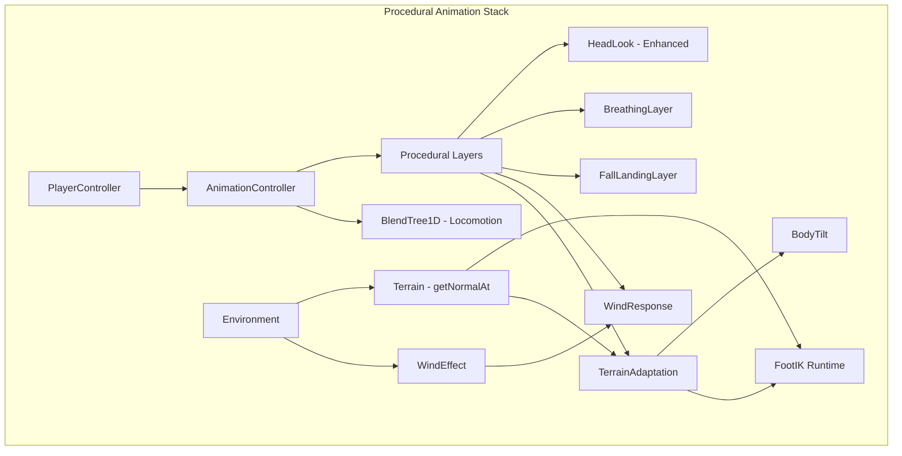

# 🦴 Procedural Animation System - Design Document

> **Goal**: Implement realistic procedural animations for the player character that adapts to terrain, wind forces, and falling/landing states.

---

## 📊 Executive Summary

This document outlines a comprehensive procedural animation system that enhances player immersion by making the character **physically respond** to the game environment. The system builds upon the existing animation architecture (BlendTree1D, AnimationController, HeadLook) and integrates with existing physics systems (terrain.getNormalAt, WindEffect).

### Key Features

| Feature | Description | Priority |
|---------|-------------|----------|
| **Terrain Adaptation** | Feet plant correctly on slopes, character tilts | 🔴 Critical |
| **Wind Response** | Body and clothing react to wind direction/speed | 🟡 High |
| **Fall/Landing** | Jump anticipation, air pose, impact absorption | 🟡 High |
| **Additive Breathing** | Subtle idle breathing, intensifies when sprinting | 🟢 Medium |
| **Look-At (Enhanced)** | Improved head/spine tracking for points of interest | 🟢 Medium |

---

## 🏗️ Architecture Overview



### Execution Order

Procedural layers apply **AFTER** the animation mixer update, overriding or blending bone transforms:

1. `AnimationMixer.update(delta)` — Base animation poses
2. `TerrainAdaptation.update(delta)` — Foot IK + Body Tilt
3. `WindResponse.update(delta)` — Wind push on bones
4. `FallLandingLayer.update(delta)` — Air/landing overrides
5. `BreathingLayer.update(delta)` — Additive breathing
6. `HeadLook.update(delta)` — Look-at (already exists)

---

## 📁 File Structure

```
js/animation/procedural/
├── HeadLook.js                  # ✅ Existing
├── TerrainAdaptation.js         # 🆕 NEW - Foot IK + Body Tilt
├── WindResponse.js              # 🆕 NEW - Wind bone influence
├── FallLandingLayer.js          # 🆕 NEW - Jump/fall/land poses
├── BreathingLayer.js            # 🆕 NEW - Additive breathing
└── ProceduralAnimationManager.js # 🆕 NEW - Orchestrates all layers
```

---

## 🚀 Implementation Phases

---

### Phase 1: Terrain Adaptation (Foot IK + Body Tilt) 🔴 Critical

**Goal**: Character feet plant correctly on uneven terrain, body tilts to match slope.

#### 1.1 Runtime Foot IK

**File**: `js/animation/procedural/TerrainAdaptation.js`

**Concept**: 
- Raycast from each foot bone downward to find terrain height
- Adjust foot Y position to match terrain
- Rotate foot to align with terrain normal
- Raise/lower hips to accommodate leg extension

**Integration Points**:
- Uses `terrain.getHeightAt(x, z)` (confirmed available in codebase)
- Uses `terrain.getNormalAt(x, z)` (confirmed available in all terrain classes)
- Extends existing `FootIK.js` from editor to runtime

```javascript
// TerrainAdaptation.js - Core Logic
export class TerrainAdaptation {
    constructor(mesh, terrain, options = {}) {
        this.mesh = mesh;
        this.terrain = terrain;
        this.enabled = true;
        
        // Configuration
        this.rayHeight = options.rayHeight || 1.5;      // Start ray above foot
        this.rayLength = options.rayLength || 2.0;      // Max search distance
        this.footOffset = options.footOffset || 0.12;   // Height above ground
        this.hipOffset = options.hipOffset || 0.0;      // Current hip adjustment
        this.lerpSpeed = options.lerpSpeed || 8.0;      // Smoothing factor
        this.maxHipDrop = options.maxHipDrop || 0.5;    // Max hip lowering
        this.bodyTiltFactor = options.bodyTiltFactor || 0.6; // How much body tilts
        
        // Bones (found dynamically)
        this.hipBone = null;
        this.leftFoot = null;
        this.rightFoot = null;
        this.spine = null;
        
        // State
        this.leftFootTarget = new THREE.Vector3();
        this.rightFootTarget = new THREE.Vector3();
        this.terrainNormal = new THREE.Vector3(0, 1, 0);
        
        this._findBones();
    }
    
    _findBones() {
        this.mesh.traverse(child => {
            if (!child.isBone) return;
            const name = child.name.toLowerCase();
            
            if (name.includes('hips') || name.includes('pelvis')) this.hipBone = child;
            if (name.includes('leftfoot') || name.includes('left_foot')) this.leftFoot = child;
            if (name.includes('rightfoot') || name.includes('right_foot')) this.rightFoot = child;
            if (name.includes('spine') && !this.spine) this.spine = child;
        });
    }
    
    update(delta) {
        if (!this.enabled || !this.hipBone) return;
        
        // 1. Get character world position
        const charPos = new THREE.Vector3();
        this.mesh.getWorldPosition(charPos);
        
        // 2. Sample terrain normal at character position
        this.terrainNormal.copy(this.terrain.getNormalAt(charPos.x, charPos.z));
        
        // 3. Process each foot
        const leftDelta = this._solveFoot(this.leftFoot, delta);
        const rightDelta = this._solveFoot(this.rightFoot, delta);
        
        // 4. Adjust hips - lower to longest leg's requirement
        const hipAdjust = Math.min(leftDelta, rightDelta, 0);
        this.hipOffset = THREE.MathUtils.lerp(
            this.hipOffset,
            Math.max(hipAdjust, -this.maxHipDrop),
            delta * this.lerpSpeed
        );
        
        if (this.hipBone && Math.abs(this.hipOffset) > 0.001) {
            this.hipBone.position.y += this.hipOffset;
        }
        
        // 5. Tilt spine to follow terrain slope
        this._applyBodyTilt(delta);
    }
    
    _solveFoot(footBone, delta) {
        if (!footBone) return 0;
        
        // Get foot world position
        const footPos = new THREE.Vector3();
        footBone.getWorldPosition(footPos);
        
        // Sample terrain height at foot XZ
        const terrainY = this.terrain.getHeightAt(footPos.x, footPos.z);
        const targetY = terrainY + this.footOffset;
        
        // Calculate required delta
        const footDelta = targetY - footPos.y;
        
        // Apply IK adjustment (simplified - raise/lower foot)
        // Full IK chain solving would use IKSolver.js
        footBone.position.y += footDelta * delta * this.lerpSpeed;
        
        // Rotate foot to align with slope
        const normal = this.terrain.getNormalAt(footPos.x, footPos.z);
        this._alignFootToNormal(footBone, normal, delta);
        
        return footDelta;
    }
    
    _alignFootToNormal(footBone, normal, delta) {
        // Calculate rotation to align foot "up" with terrain normal
        const up = new THREE.Vector3(0, 1, 0);
        const alignQuat = new THREE.Quaternion().setFromUnitVectors(up, normal);
        
        // Blend with current rotation
        footBone.quaternion.slerp(
            footBone.quaternion.clone().multiply(alignQuat),
            delta * this.lerpSpeed * 0.5
        );
    }
    
    _applyBodyTilt(delta) {
        if (!this.spine) return;
        
        // Tilt spine forward on uphill, backward on downhill
        // Get slope direction relative to character forward
        const forward = new THREE.Vector3(0, 0, -1);
        forward.applyQuaternion(this.mesh.quaternion);
        
        // Dot product tells us if slope is uphill or downhill
        const slopeDot = this.terrainNormal.dot(forward);
        
        // Apply subtle spine rotation
        const tiltAngle = slopeDot * this.bodyTiltFactor * 0.2; // Max ~12 degrees
        const tiltQuat = new THREE.Quaternion().setFromAxisAngle(
            new THREE.Vector3(1, 0, 0), // Pitch axis
            tiltAngle
        );
        
        this.spine.quaternion.slerp(
            this.spine.quaternion.clone().multiply(tiltQuat),
            delta * this.lerpSpeed * 0.3
        );
    }
}
```

#### 1.2 Verification Checklist

- [ ] Feet stay planted on flat terrain
- [ ] Feet adjust to uphill slopes (character tilts forward)
- [ ] Feet adjust to downhill slopes (character tilts backward)
- [ ] Hips lower when standing on uneven surfaces (one foot higher than other)
- [ ] No foot clipping through terrain
- [ ] Smooth transitions when terrain changes

---

### Phase 2: Wind Response 🟡 High

**Goal**: Character leans into wind, hair/cloth bones react.

**File**: `js/animation/procedural/WindResponse.js`

**Integration Points**:
- Reads from existing `WindEffect.js` (confirmed: `windDirection`, `windSpeed`, `gustStrength`)
- Applies additive rotations to spine, head, and optional cloth bones

```javascript
// WindResponse.js - Core Logic
export class WindResponse {
    constructor(mesh, windEffect, options = {}) {
        this.mesh = mesh;
        this.windEffect = windEffect; // Reference to WindEffect instance
        this.enabled = true;
        
        // Configuration
        this.bodyInfluence = options.bodyInfluence || 0.15;   // How much body leans
        this.headInfluence = options.headInfluence || 0.25;   // How much head turns away
        this.noiseScale = options.noiseScale || 0.3;          // Random flutter
        this.lerpSpeed = options.lerpSpeed || 3.0;
        
        // Bones
        this.spine = null;
        this.chest = null;
        this.head = null;
        this.clothBones = [];  // Optional: cape, hair, etc.
        
        // State
        this.currentLean = new THREE.Vector3();
        this.time = 0;
        
        this._findBones();
    }
    
    _findBones() {
        this.mesh.traverse(child => {
            if (!child.isBone) return;
            const name = child.name.toLowerCase();
            
            if (name.includes('spine') && !name.includes('spine2')) this.spine = child;
            if (name.includes('spine2') || name.includes('chest')) this.chest = child;
            if (name === 'head' || name.includes(':head')) this.head = child;
            
            // Collect cloth-like bones
            if (name.includes('cape') || name.includes('cloth') || name.includes('hair')) {
                this.clothBones.push(child);
            }
        });
    }
    
    update(delta) {
        if (!this.enabled || !this.windEffect || !this.windEffect.enabled) return;
        
        this.time += delta;
        
        // Get wind data
        const windDir = this.windEffect.windDirection.clone();
        const windSpeed = this.windEffect.windSpeed;
        const normalizedSpeed = Math.min(windSpeed / 100, 1.0); // 0-1 range
        
        // Add gust variation
        const gustFactor = 1.0 + Math.sin(this.time * 2.3) * this.windEffect.gustStrength;
        const effectiveSpeed = normalizedSpeed * gustFactor;
        
        // Transform wind to character local space
        const charWorldQuat = new THREE.Quaternion();
        this.mesh.getWorldQuaternion(charWorldQuat);
        const localWind = windDir.clone().applyQuaternion(charWorldQuat.invert());
        
        // Calculate target lean
        const targetLean = new THREE.Vector3(
            -localWind.z * effectiveSpeed * this.bodyInfluence, // Pitch
            0,
            localWind.x * effectiveSpeed * this.bodyInfluence   // Roll
        );
        
        // Smooth interpolation
        this.currentLean.lerp(targetLean, delta * this.lerpSpeed);
        
        // Apply to spine chain
        this._applyToSpine(delta);
        
        // Apply stronger effect to cloth bones
        this._applyToCloth(delta, localWind, effectiveSpeed);
    }
    
    _applyToSpine(delta) {
        const bones = [this.spine, this.chest].filter(b => b);
        const influencePerBone = this.currentLean.clone().multiplyScalar(1 / bones.length);
        
        bones.forEach(bone => {
            const rotQuat = new THREE.Quaternion().setFromEuler(
                new THREE.Euler(influencePerBone.x, influencePerBone.y, influencePerBone.z)
            );
            bone.quaternion.multiply(rotQuat);
        });
        
        // Head turns away from wind slightly
        if (this.head) {
            const headDodge = new THREE.Quaternion().setFromAxisAngle(
                new THREE.Vector3(0, 1, 0),
                this.currentLean.z * this.headInfluence * -2
            );
            this.head.quaternion.multiply(headDodge);
        }
    }
    
    _applyToCloth(delta, localWind, speed) {
        if (this.clothBones.length === 0) return;
        
        this.clothBones.forEach((bone, i) => {
            // Each cloth bone gets progressively more influence
            const depthFactor = 1 + i * 0.5;
            const noise = Math.sin(this.time * 5 + i * 0.7) * this.noiseScale;
            
            const clothLean = new THREE.Quaternion().setFromEuler(
                new THREE.Euler(
                    -localWind.z * speed * 0.5 * depthFactor + noise * 0.1,
                    0,
                    localWind.x * speed * 0.5 * depthFactor + noise * 0.1
                )
            );
            
            bone.quaternion.multiply(clothLean);
        });
    }
}
```

#### 2.1 Verification Checklist

- [ ] Character leans into headwind
- [ ] Character pushed by tailwind
- [ ] Lean intensity scales with wind speed
- [ ] Gusts cause visible flutter
- [ ] Cape/cloth bones (if present) react more dramatically
- [ ] No unnatural snapping

---

### Phase 3: Fall/Landing Layer 🟡 High

**Goal**: Natural jump anticipation, air pose, and impact absorption.

**File**: `js/animation/procedural/FallLandingLayer.js`

**States**:
1. **Grounded** — No effect
2. **Ascending** — Arms slightly back, legs tucked
3. **Apex** — Brief transition pose
4. **Falling** — Arms up, legs spread
5. **Landing** — Crouch absorption (scales with fall duration)

```javascript
// FallLandingLayer.js - Core Logic
export class FallLandingLayer {
    constructor(mesh, playerController, options = {}) {
        this.mesh = mesh;
        this.player = playerController;
        this.enabled = true;
        
        // State
        this.state = 'grounded'; // grounded, ascending, apex, falling, landing
        this.airTime = 0;
        this.landingProgress = 0;
        this.previousVelocityY = 0;
        
        // Configuration
        this.armRaise = options.armRaise || 0.3;        // How much arms raise when falling
        this.legSpread = options.legSpread || 0.15;     // Leg spread factor
        this.landingCrouchFactor = options.landingCrouchFactor || 0.4;
        this.landingDuration = options.landingDuration || 0.3; // Seconds
        this.apexThreshold = options.apexThreshold || 2.0;     // Velocity threshold
        
        // Bones
        this.spine = null;
        this.leftUpperArm = null;
        this.rightUpperArm = null;
        this.leftUpperLeg = null;
        this.rightUpperLeg = null;
        this.hips = null;
        
        this._findBones();
    }
    
    _findBones() {
        this.mesh.traverse(child => {
            if (!child.isBone) return;
            const name = child.name.toLowerCase();
            
            if (name.includes('spine') && !this.spine) this.spine = child;
            if (name.includes('hips')) this.hips = child;
            if (name.includes('leftarm') && !name.includes('fore')) this.leftUpperArm = child;
            if (name.includes('rightarm') && !name.includes('fore')) this.rightUpperArm = child;
            if (name.includes('leftupleg') || name.includes('left_thigh')) this.leftUpperLeg = child;
            if (name.includes('rightupleg') || name.includes('right_thigh')) this.rightUpperLeg = child;
        });
    }
    
    update(delta) {
        if (!this.enabled) return;
        
        const velocityY = this.player.velocity.y;
        const isGrounded = this.player.isGrounded;
        
        // State machine
        this._updateState(velocityY, isGrounded, delta);
        
        // Apply procedural adjustments based on state
        switch (this.state) {
            case 'ascending':
                this._applyAscending(delta);
                break;
            case 'apex':
                this._applyApex(delta);
                break;
            case 'falling':
                this._applyFalling(delta);
                break;
            case 'landing':
                this._applyLanding(delta);
                break;
        }
        
        this.previousVelocityY = velocityY;
    }
    
    _updateState(velocityY, isGrounded, delta) {
        const wasAirborne = this.state !== 'grounded' && this.state !== 'landing';
        
        if (isGrounded) {
            if (wasAirborne) {
                // Just landed
                this.state = 'landing';
                this.landingProgress = 0;
            } else if (this.state === 'landing') {
                this.landingProgress += delta / this.landingDuration;
                if (this.landingProgress >= 1.0) {
                    this.state = 'grounded';
                    this.airTime = 0;
                }
            } else {
                this.state = 'grounded';
            }
        } else {
            // In air
            this.airTime += delta;
            
            if (velocityY > this.apexThreshold) {
                this.state = 'ascending';
            } else if (velocityY < -this.apexThreshold) {
                this.state = 'falling';
            } else {
                this.state = 'apex';
            }
        }
    }
    
    _applyAscending(delta) {
        // Arms slightly back, preparing for apex
        this._rotateArms(-0.2, delta);
        // Legs tuck slightly
        this._rotateLegsPitch(0.1, delta);
    }
    
    _applyApex(delta) {
        // Neutral transition - relax arms
        this._rotateArms(0, delta);
    }
    
    _applyFalling(delta) {
        // Arms raise for balance
        this._rotateArms(this.armRaise, delta);
        // Legs spread slightly
        this._rotateLegsSpread(this.legSpread, delta);
        
        // Spine leans forward slightly for "reaching" pose
        if (this.spine) {
            const leanQuat = new THREE.Quaternion().setFromAxisAngle(
                new THREE.Vector3(1, 0, 0),
                0.1
            );
            this.spine.quaternion.multiply(leanQuat);
        }
    }
    
    _applyLanding(delta) {
        // Crouch absorption - intensity based on air time
        const crouchIntensity = Math.min(this.airTime * 0.5, 1.0) * this.landingCrouchFactor;
        const easeOut = 1 - this.landingProgress;
        
        if (this.hips) {
            // Lower hips for crouch
            this.hips.position.y -= crouchIntensity * easeOut * 0.3;
        }
        
        // Bend spine forward
        if (this.spine) {
            const crouchQuat = new THREE.Quaternion().setFromAxisAngle(
                new THREE.Vector3(1, 0, 0),
                crouchIntensity * easeOut * 0.3
            );
            this.spine.quaternion.multiply(crouchQuat);
        }
    }
    
    _rotateArms(amount, delta) {
        // Raise/lower upper arms
        const armBones = [this.leftUpperArm, this.rightUpperArm].filter(b => b);
        
        armBones.forEach((bone, i) => {
            const sign = i === 0 ? 1 : -1; // Mirror for left/right
            const rotQuat = new THREE.Quaternion().setFromAxisAngle(
                new THREE.Vector3(0, 0, sign),
                amount
            );
            bone.quaternion.slerp(bone.quaternion.clone().multiply(rotQuat), delta * 5);
        });
    }
    
    _rotateLegsPitch(amount, delta) {
        const legBones = [this.leftUpperLeg, this.rightUpperLeg].filter(b => b);
        
        legBones.forEach(bone => {
            const rotQuat = new THREE.Quaternion().setFromAxisAngle(
                new THREE.Vector3(1, 0, 0),
                -amount // Negative to tuck forward
            );
            bone.quaternion.slerp(bone.quaternion.clone().multiply(rotQuat), delta * 5);
        });
    }
    
    _rotateLegsSpread(amount, delta) {
        if (this.leftUpperLeg) {
            const leftSpread = new THREE.Quaternion().setFromAxisAngle(
                new THREE.Vector3(0, 0, 1),
                amount
            );
            this.leftUpperLeg.quaternion.multiply(leftSpread);
        }
        
        if (this.rightUpperLeg) {
            const rightSpread = new THREE.Quaternion().setFromAxisAngle(
                new THREE.Vector3(0, 0, 1),
                -amount
            );
            this.rightUpperLeg.quaternion.multiply(rightSpread);
        }
    }
}
```

#### 3.1 Verification Checklist

- [ ] Arms move back slightly on jump start
- [ ] Natural apex pose at peak of jump
- [ ] Arms raise and legs spread during fall
- [ ] Landing crouch scales with fall duration
- [ ] No jittering or sudden snaps
- [ ] Integrates smoothly with jump animation

---

### Phase 4: Additive Breathing 🟢 Medium

**Goal**: Subtle chest/shoulder rise and fall, intensifies with activity.

**File**: `js/animation/procedural/BreathingLayer.js`

```javascript
// BreathingLayer.js - Core Logic
export class BreathingLayer {
    constructor(mesh, playerController, options = {}) {
        this.mesh = mesh;
        this.player = playerController;
        this.enabled = true;
        
        // Configuration
        this.baseRate = options.baseRate || 0.3;        // Breaths per second (idle)
        this.sprintRate = options.sprintRate || 0.8;    // Breaths per second (sprinting)
        this.intensity = options.intensity || 0.015;    // Chest rise amount
        this.sprintIntensity = options.sprintIntensity || 0.04;
        
        // Bones
        this.chest = null;
        this.leftShoulder = null;
        this.rightShoulder = null;
        
        // State
        this.time = 0;
        this.currentRate = this.baseRate;
        this.currentIntensity = this.intensity;
        
        this._findBones();
    }
    
    _findBones() {
        this.mesh.traverse(child => {
            if (!child.isBone) return;
            const name = child.name.toLowerCase();
            
            if (name.includes('spine2') || name.includes('chest')) this.chest = child;
            if (name.includes('leftshoulder')) this.leftShoulder = child;
            if (name.includes('rightshoulder')) this.rightShoulder = child;
        });
    }
    
    update(delta) {
        if (!this.enabled || !this.chest) return;
        
        this.time += delta;
        
        // Adjust breathing rate based on activity
        const isSprinting = this.player.isSprinting;
        const speed = this.player.velocity.length();
        const activityFactor = Math.min(speed / 20, 1); // 0-1 based on speed
        
        // Interpolate rate and intensity
        const targetRate = this.baseRate + (this.sprintRate - this.baseRate) * activityFactor;
        const targetIntensity = this.intensity + (this.sprintIntensity - this.intensity) * activityFactor;
        
        this.currentRate = THREE.MathUtils.lerp(this.currentRate, targetRate, delta * 2);
        this.currentIntensity = THREE.MathUtils.lerp(this.currentIntensity, targetIntensity, delta * 2);
        
        // Calculate breath phase (0-1)
        const breathPhase = (Math.sin(this.time * this.currentRate * Math.PI * 2) + 1) / 2;
        
        // Apply to chest
        const chestRise = breathPhase * this.currentIntensity;
        this.chest.position.y += chestRise;
        
        // Subtle chest expansion (scale)
        this.chest.scale.x = 1 + breathPhase * this.currentIntensity * 0.5;
        this.chest.scale.z = 1 + breathPhase * this.currentIntensity * 0.3;
        
        // Shoulders rise slightly
        this._applyShoulderBreathe(breathPhase);
    }
    
    _applyShoulderBreathe(phase) {
        const shoulderRise = phase * this.currentIntensity * 0.3;
        
        if (this.leftShoulder) {
            this.leftShoulder.position.y += shoulderRise;
        }
        if (this.rightShoulder) {
            this.rightShoulder.position.y += shoulderRise;
        }
    }
}
```

---

### Phase 5: Procedural Animation Manager 🔴 Critical

**Goal**: Unified manager that orchestrates all procedural layers.

**File**: `js/animation/procedural/ProceduralAnimationManager.js`

```javascript
// ProceduralAnimationManager.js - Orchestrator
import { TerrainAdaptation } from './TerrainAdaptation.js';
import { WindResponse } from './WindResponse.js';
import { FallLandingLayer } from './FallLandingLayer.js';
import { BreathingLayer } from './BreathingLayer.js';
import { HeadLook } from './HeadLook.js';

export class ProceduralAnimationManager {
    constructor(mesh, options = {}) {
        this.mesh = mesh;
        this.layers = [];
        this.enabled = true;
        
        // Layer references for external access
        this.terrainAdaptation = null;
        this.windResponse = null;
        this.fallLanding = null;
        this.breathing = null;
        this.headLook = null;
    }
    
    /**
     * Initialize all procedural layers
     * @param {Object} context - { terrain, windEffect, playerController }
     */
    initialize(context) {
        const { terrain, windEffect, playerController } = context;
        
        // Terrain Adaptation (Foot IK + Body Tilt)
        if (terrain) {
            this.terrainAdaptation = new TerrainAdaptation(this.mesh, terrain);
            this.layers.push(this.terrainAdaptation);
        }
        
        // Wind Response
        if (windEffect) {
            this.windResponse = new WindResponse(this.mesh, windEffect);
            this.layers.push(this.windResponse);
        }
        
        // Fall/Landing
        if (playerController) {
            this.fallLanding = new FallLandingLayer(this.mesh, playerController);
            this.layers.push(this.fallLanding);
            
            // Breathing
            this.breathing = new BreathingLayer(this.mesh, playerController);
            this.layers.push(this.breathing);
        }
        
        // Head Look (enhanced version of existing)
        this.headLook = new HeadLook(this.mesh);
        this.layers.push(this.headLook);
        
        console.log(`[ProceduralAnimationManager] Initialized ${this.layers.length} layers`);
    }
    
    /**
     * Update all procedural layers
     * Must be called AFTER AnimationMixer.update()
     * @param {number} delta - Time delta in seconds
     */
    update(delta) {
        if (!this.enabled) return;
        
        for (const layer of this.layers) {
            if (layer.enabled) {
                layer.update(delta);
            }
        }
    }
    
    /**
     * Set look-at target for HeadLook layer
     * @param {THREE.Vector3|null} target 
     */
    setLookTarget(target) {
        if (this.headLook) {
            this.headLook.setTarget(target);
        }
    }
    
    /**
     * Enable/disable specific layers
     * @param {string} layerName 
     * @param {boolean} enabled 
     */
    setLayerEnabled(layerName, enabled) {
        const layer = this[layerName];
        if (layer) {
            layer.enabled = enabled;
        }
    }
    
    /**
     * Configure layer options at runtime
     * @param {string} layerName 
     * @param {Object} options 
     */
    configureLayer(layerName, options) {
        const layer = this[layerName];
        if (layer) {
            Object.assign(layer, options);
        }
    }
    
    dispose() {
        this.layers = [];
        this.terrainAdaptation = null;
        this.windResponse = null;
        this.fallLanding = null;
        this.breathing = null;
        this.headLook = null;
    }
}
```

---

## 🔗 Integration with PlayerController

**Modified**: `js/core/player.js`

```javascript
// In PlayerController constructor
import { ProceduralAnimationManager } from '../animation/procedural/ProceduralAnimationManager.js';

constructor(terrain) {
    // ... existing code ...
    
    // Procedural Animation Manager
    this.proceduralManager = null;
}

// In loadModel() after mesh is loaded
async loadModel(scene) {
    // ... existing loading code ...
    
    manager.onLoad = () => {
        // ... existing initialization ...
        
        // Initialize Procedural Animation Manager
        this.proceduralManager = new ProceduralAnimationManager(this.mesh);
        this.proceduralManager.initialize({
            terrain: this.terrain,
            windEffect: this.windEffect, // Will need to be passed in
            playerController: this
        });
        
        // Register with AnimationController as procedural layer
        this.animator.addProceduralLayer(this.proceduralManager);
    };
}
```

---

## 📋 Implementation Order

| Order | Component | Effort | Dependencies |
|-------|-----------|--------|--------------|
| 1 | `ProceduralAnimationManager.js` | 1 hour | None |
| 2 | `TerrainAdaptation.js` | 3 hours | terrain.getNormalAt |
| 3 | `FallLandingLayer.js` | 2 hours | PlayerController.velocity |
| 4 | `WindResponse.js` | 2 hours | WindEffect instance |
| 5 | `BreathingLayer.js` | 1 hour | PlayerController.isSprinting |
| 6 | `HeadLook.js` enhancement | 1 hour | Existing HeadLook |
| 7 | Player.js integration | 1 hour | All above |

**Total Estimated Effort**: 11 hours

---

## ✅ Overall Verification Checklist

### Core Functionality
- [ ] ProceduralAnimationManager initializes correctly
- [ ] Layers execute in correct order (after mixer update)
- [ ] No errors when individual layers are disabled

### Terrain Adaptation
- [ ] Feet plant on flat ground
- [ ] Feet adapt to slopes
- [ ] Body tilts on inclines
- [ ] Hips adjust for leg length differences

### Wind Response
- [ ] Character leans into wind
- [ ] Intensity scales with wind speed
- [ ] Gusts cause visible flutter
- [ ] Works correctly at different character orientations

### Fall/Landing
- [ ] Jump has natural anticipation
- [ ] Air pose looks balanced
- [ ] Landing crouch scales with fall duration
- [ ] Smooth transitions between states

### Breathing
- [ ] Visible chest rise/fall at idle
- [ ] Breathing intensifies when sprinting
- [ ] No visible pop when starting/stopping

### Integration
- [ ] Works with all animation sets (basic, knight)
- [ ] Works with blend tree transitions
- [ ] No conflicts with existing HeadLook
- [ ] Performance acceptable (< 1ms per frame)

---

## 🎯 Success Criteria

1. **Visual Quality**: Character appears to physically exist in the world
2. **Responsiveness**: Reactions feel immediate, not delayed
3. **Smoothness**: No sudden snaps or jitters
4. **Performance**: No measurable FPS impact
5. **Extensibility**: Easy to add new procedural layers

---

*Document created: January 14, 2026*
*Target completion: Phase 1-3 (Core features)*
